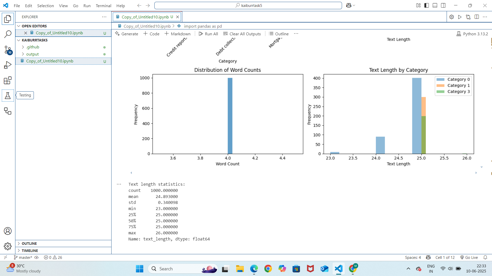
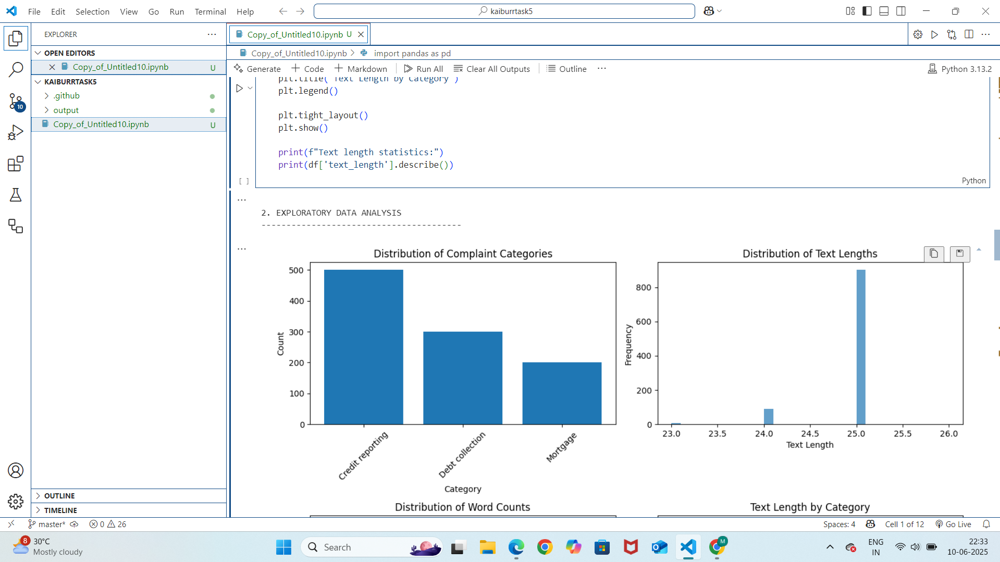
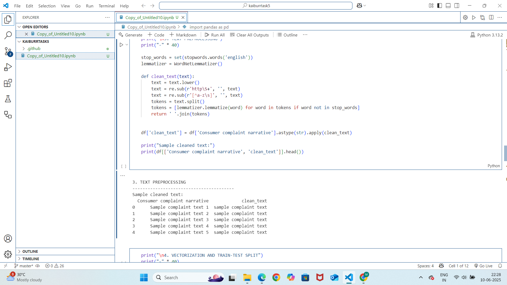

# Task 5 - Text Classification: Consumer Complaints

## Overview
This project classifies consumer complaints into 4 categories.

## Dataset
- Source: https://catalog.data.gov/dataset/consumer-complaint-database
- File used: `consumer_complaints_1000.csv`

## Steps Followed

### 1. EDA & Feature Engineering

### 2. Text Preprocessing

### 3. Model Training

### 4. Model Comparison

### 5. Evaluation & Prediction

## How to Run
1. Clone the repo.
2. Install requirements.`
3. Run notebooks in order from `/notebooks`

